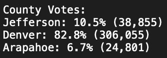
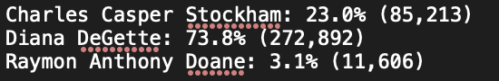
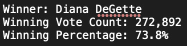
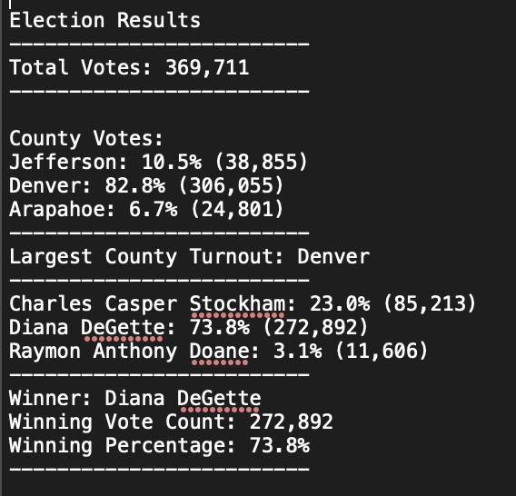

# Election Analysis

## Overview of Project

This analysis was created to determine the winning candidate for an election in Colorado, along with analyzing the number of votes cast in respective counties, and overall. The deliverables include:
- Total number of votes cast
- A complete list of counties and candidates that received votes
- Total number of votes each county and candidate received
- Percentage of votes each county received and candidate won
- The winner of the election based on popular vote and the largest county turnout 

## Election Audit Results

- How many votes were cast in this congressional election?
  
  369,711 total votes were cast
  
- Provide a breakdown of the number of votes and the percentage of total votes for each county in the precinct.
  
  
- Which county had the largest number of votes?
 
  Denver County
  
- Provide a breakdown of the number of votes and the percentage of the total votes each candidate received.
  
  
- Which candidate won the election, what was their vote count, and what was their percentage of the total votes?
  

Here is the overall breakdown of our results for this analysis:

  
	
## Election Audit Summary
